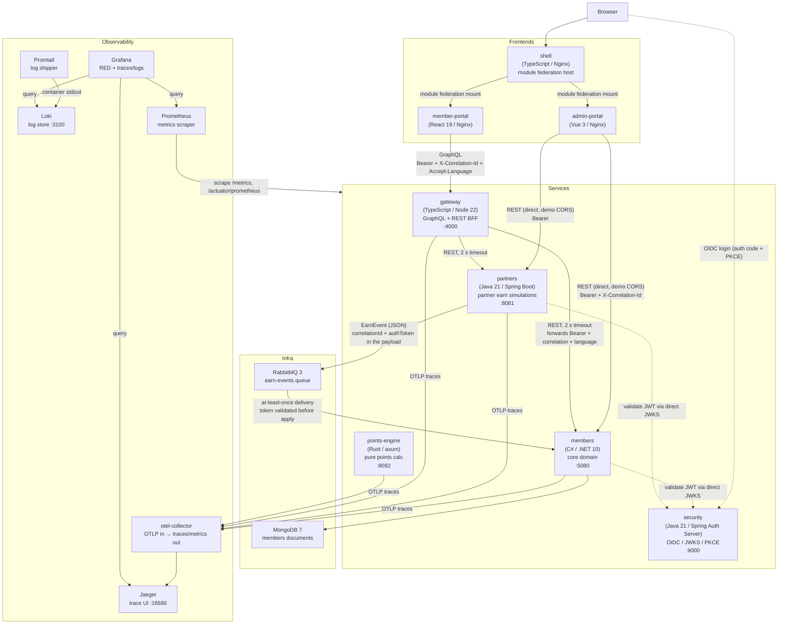

# Architecture overview

Osprey Loyalty is a miniature airline-style loyalty platform built as a multi-language demo. It runs as a set of Docker containers — five backend services (including a first-party OIDC identity service and a Rust points engine), a message broker, a database, three frontend artifacts, and a full observability stack (OpenTelemetry → Jaeger for traces, Loki for logs, Prometheus/Grafana for metrics) — all wired together in a single `docker compose up`. Phase 6 added enterprise concerns: zero-trust JWT validation on every service (with a per-service kill-switch, off by default), five-language i18n on both the frontends and backend messages, and an in-app help system. The intended audience for this document is a reviewer spending five minutes in the repo.

---

## Container diagram

`X-Correlation-Id` is generated by the gateway on every inbound request and propagated to upstream REST calls. It also travels through RabbitMQ as an optional `correlationId` field on the `EarnEvent` payload (not an AMQP header), so a single earn flow is traceable across gateway → partners → queue → members in the structured logs. Phase 6 adds OpenTelemetry trace context on top: each backend exports OTLP spans to the collector (→ Jaeger), and every log line carries the `trace_id`/`span_id` so Loki logs line up with Jaeger spans. Under zero-trust (kill-switch on), the gateway forwards the caller's Bearer downstream, and partners mints a short-lived service token that members validates before applying an earn off the queue (ADR-0007).

---

## Containers

**shell** — a thin TypeScript host served by Nginx that composes the two portals via Vite module federation. It owns navigation only; it has no knowledge of either app's internals. See ADR-0004 for the trade-off analysis and an honest account of when not to use this pattern.

**member-portal** — the main user-facing app, built in React 19 with TanStack Query and GraphQL codegen against the gateway schema. The showpiece frontend: dashboard with tier progress, paginated transactions, rewards with optimistic UI, a tier overview, and a Travel Agent page that streams a simulated, points-first trip planner over SSE (its own feature slice under `src/features/travel-agent`).

**admin-portal** — a Vue 3 app for admin tasks: member lookup, manual point adjustments, partner rate editing, and OSPREY invitations. Calls members and partners directly over REST rather than through the gateway, which is acceptable for an internal admin surface in a demo context with no auth.

**gateway** — a TypeScript/Node 22 BFF using GraphQL Yoga. It owns the schema the member portal queries and enforces a 2-second timeout on every call to members and partners. Input validation with zod; environment validated at startup. The aggregation edge: member portal never calls backend services directly. Alongside GraphQL it hosts one Server-Sent-Events endpoint, `GET /travel-agent/stream`, a self-contained feature slice (`src/features/travel-agent`) that streams the simulated Travel Agent's reply — a pure planning core over a fake, award-priced trip catalogue behind a single thin SSE edge (A-Frame, with failures surfaced as an `error` event; see the README).

**members** — the core loyalty domain, written in C# on .NET 10 with Vertical Slice Architecture. Handles enrollment, member profiles, the tier ladder (rolling 12-month window, MEMBER through DIAMOND thresholds, OSPREY by invitation only), the points ledger, redemption, manual adjustments, and point expiry. Stores one document per member in MongoDB. The deepest quality surface in the repo: strict TDD, pure domain core with no I/O, idempotent event processing, and a showcase duplicate-delivery test.

**partners** — a Java 21/Spring Boot service that simulates the three partner earn sources: CardCo, StayInn, and WheelsGo. On a purchase POST it computes points, assigns an idempotency key, and publishes an `EarnEvent` to RabbitMQ. Includes a `/duplicate-demo` endpoint that deliberately publishes the same event twice, proving downstream idempotency. Under zero-trust it also mints a short-lived HS256 service token and stamps it on each `EarnEvent` (the async leg of auth — ADR-0007).

**security** — a Java 21 / Spring Authorization Server acting as the first-party OIDC identity service (`:9000`). Exposes `/.well-known/openid-configuration`, `/oauth2/authorize`, `/oauth2/token`, and `/oauth2/jwks`. In-memory demo users and registered clients (member-portal and admin-portal as public PKCE clients; partners-service as a confidential client-credentials client), a persistent RSA signing key, and access tokens carrying `roles` plus a fleet-wide `aud`. See ADR-0007.

**points-engine** — a small Rust/axum service (`:8082`) exposing a pure points-calculation endpoint over exact decimal arithmetic, kept in parity with the members earn formula (ADR-0006). It sits outside the earn path and is the fleet's fourth metrics source.

**RabbitMQ** — the event backbone between partners and members. One quorum queue (`earn-events`) with a delivery limit of five; undeliverable messages land on `earn-events.dead`. See ADR-0001.

**MongoDB** — document store for the members service. Stands in for Cosmos DB's Mongo API; query patterns and index shapes are identical. One collection per concern; bounded queries throughout.

**Prometheus** — scrapes `/metrics` from members and gateway, and `/actuator/prometheus` from partners, on a 15-second interval. No data leaves the compose network.

**Grafana** — pre-provisioned dashboards reading from all three backends: RED metrics (request rate, error rate, duration) from Prometheus, traces from Jaeger, and logs from Loki, cross-linked by `trace_id`. Available at `localhost:3000` in the compose stack.

**otel-collector** — the single OTLP sink for the fleet. Receives spans from members, gateway, partners, and points-engine, batches them, and forwards traces to Jaeger; any OTLP metrics are re-exposed for Prometheus. See ADR-0008.

**Jaeger** — all-in-one trace store and UI (`localhost:16686`), ingesting OTLP from the collector. One trace spans frontend → gateway → members/partners → (RabbitMQ) → members.

**Loki + Promtail** — Promtail ships every container's structured-JSON stdout to Loki (`localhost:3100`); because every backend logs `correlationId` and `trace_id`, one query follows a request across services and links straight to its Jaeger trace.

---

## Decisions

| ADR | Decision |
|-----|----------|
| [ADR-0001](decisions/0001-queue-rabbitmq.md) | RabbitMQ as the event backbone — quorum queue with dead-lettering after five delivery attempts |
| [ADR-0002](decisions/0002-idempotency-unique-ledger-key.md) | Idempotency via unique MongoDB index on `PointsTransaction.idempotencyKey` — the database is the single arbiter |
| [ADR-0003](decisions/0003-redemption-concurrency-conditional-update.md) | Redemption concurrency via atomic conditional decrement — no locks, no retry loops |
| [ADR-0004](decisions/0004-micro-frontend-tradeoff.md) | Micro-frontend composition via Vite module federation — with an explicit account of when not to use it |
| [ADR-0005](decisions/0005-service-boundaries.md) | Four service boundaries — members is not split further because ledger, tiers, redemption, and expiry share one consistency boundary |
| [ADR-0006](decisions/0006-rust-points-engine.md) | A Rust points-engine as a parity oracle for the earn formula — exact decimal arithmetic, kept in lockstep with members |
| [ADR-0007](decisions/0007-zero-trust-auth.md) | Zero-trust JWT validation on every service (incl. the RabbitMQ hop) behind a per-service kill-switch; first-party Spring Authorization Server as the IdP |
| [ADR-0008](decisions/0008-opentelemetry-observability.md) | OpenTelemetry → Jaeger (traces) + Loki (logs) + Prometheus/Grafana (metrics), correlated by `trace_id` |
| [ADR-0009](decisions/0009-i18n-strategy.md) | Five-language i18n on the frontends (react-i18next / vue-i18n) and backend messages (per-service catalogs keyed off `Accept-Language`) |
| [ADR-0010](decisions/0010-in-app-help.md) | An in-app, localized "?" help dialog per page, sourced from the i18n catalogs so help ships in all five languages for free |
| [ADR-0011](decisions/0011-traefik-ingress.md) | Traefik as the ingress controller — a single entry point routing to every service and frontend in the local cluster |
| [ADR-0012](decisions/0012-compute-model-k8s-over-serverless.md) | Kubernetes over serverless for the whole fleet — a conscious showcase choice; the stateless edges (points-engine, expiry sweep, earn consumer) are the first to move to functions if cost, not demonstration, were the goal |

---

## No longer missing (Phase 6)

- **Authentication.** A first-party OIDC identity service (security) plus zero-trust JWT validation on every service — including the RabbitMQ earn hop. Admin surfaces require the `admin` role; the member portal resolves identity from the token `sub`. The whole thing sits behind a per-service kill-switch (off by default) so the demo, e2e, and tests run open. See ADR-0007.
- **Distributed tracing.** OpenTelemetry spans from every backend flow through the collector to Jaeger, and `trace_id`/`span_id` are stamped into every log line so Loki logs line up with Jaeger spans. See ADR-0008.
- **Internationalization.** Five languages (sv/en/es/de/it) across the frontends and backend validation/error messages.

## Still deliberately missing

- **Single replicas.** All services run as single containers in compose. The idempotency and concurrency patterns (ADR-0002, ADR-0003) are designed to hold under multiple replicas, but the demo does not exercise that.
- **No backups.** The MongoDB volume is ephemeral. `docker compose down -v` loses all data.
- **No secret management.** Connection strings, the demo signing keys, and credentials are plain environment variables in the compose file. The IdP uses in-memory users/clients rather than a database (ADR-0007 notes Postgres for production).
- **Browser-interactive auth only in the demo sense.** The PKCE login flow is wired end to end, but the demo users and the RSA key live in memory and reset on restart.
