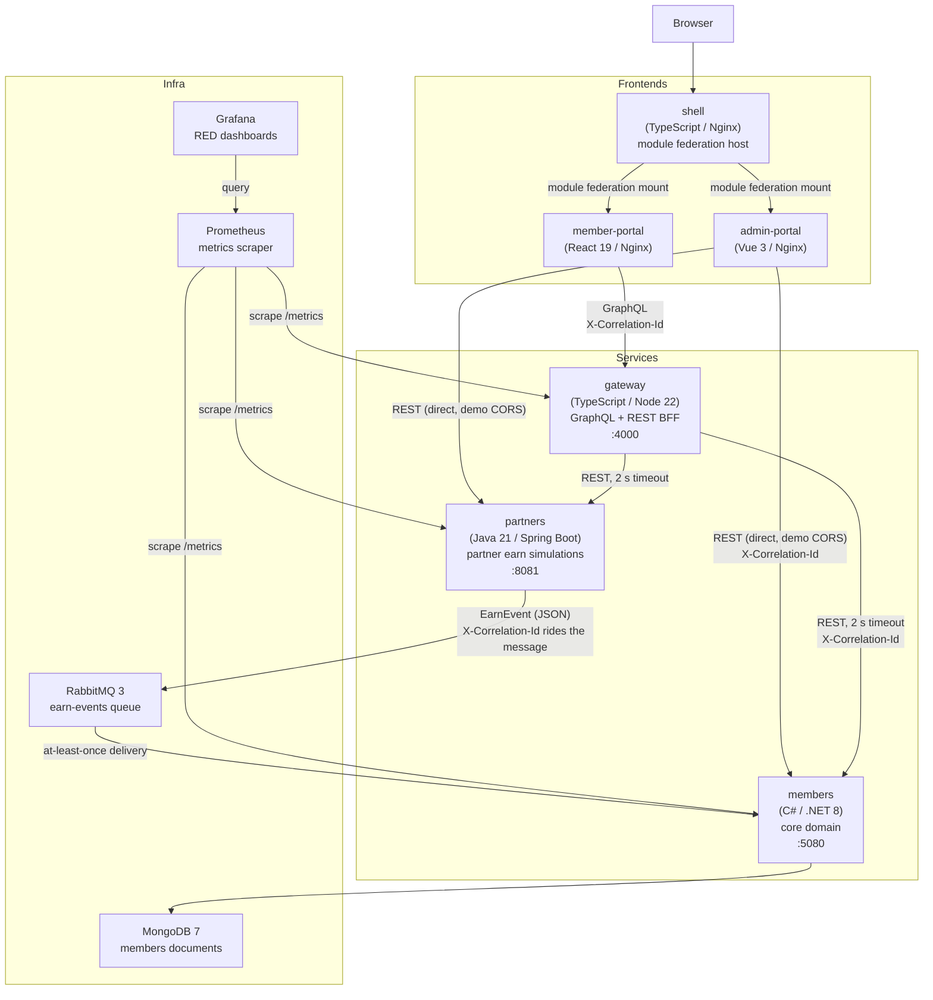

# Architecture overview

Osprey Loyalty is a miniature airline-style loyalty platform built as a multi-language demo. It runs as a set of Docker containers — three backend services, a message broker, a database, three frontend artifacts, and an observability stack — all wired together in a single `docker compose up`. The intended audience for this document is a reviewer spending five minutes in the repo.

---

## Container diagram

`X-Correlation-Id` is generated by the gateway on every inbound request and propagated to upstream REST calls. It also travels as a message header on `EarnEvent`s through RabbitMQ, so a single earn flow is traceable across gateway → partners → queue → members in the structured logs.

---

## Containers

**shell** — a thin TypeScript host served by Nginx that composes the two portals via Vite module federation. It owns navigation only; it has no knowledge of either app's internals. See ADR-0004 for the trade-off analysis and an honest account of when not to use this pattern.

**member-portal** — the main user-facing app, built in React 19 with TanStack Query and GraphQL codegen against the gateway schema. The showpiece frontend: dashboard with tier progress, paginated transactions, rewards with optimistic UI, and a tier overview.

**admin-portal** — a Vue 3 app for admin tasks: member lookup, manual point adjustments, partner rate editing, and PANDION invitations. Calls members and partners directly over REST rather than through the gateway, which is acceptable for an internal admin surface in a demo context with no auth.

**gateway** — a TypeScript/Node 22 BFF using GraphQL Yoga. It owns the schema the member portal queries and enforces a 2-second timeout on every call to members and partners. Input validation with zod; environment validated at startup. The aggregation edge: member portal never calls backend services directly.

**members** — the core loyalty domain, written in C# on .NET 8 with Vertical Slice Architecture. Handles enrollment, member profiles, the tier ladder (rolling 12-month window, MEMBER through DIAMOND thresholds, PANDION by invitation only), the points ledger, redemption, manual adjustments, and point expiry. Stores one document per member in MongoDB. The deepest quality surface in the repo: strict TDD, pure domain core with no I/O, idempotent event processing, and a showcase duplicate-delivery test.

**partners** — a Java 21/Spring Boot service that simulates the three partner earn sources: CardCo, StayInn, and WheelsGo. On a purchase POST it computes points, assigns an idempotency key, and publishes an `EarnEvent` to RabbitMQ. Includes a `/duplicate-demo` endpoint that deliberately publishes the same event twice, proving downstream idempotency.

**RabbitMQ** — the event backbone between partners and members. One quorum queue (`earn-events`) with a delivery limit of five; undeliverable messages land on `earn-events.dead`. See ADR-0001.

**MongoDB** — document store for the members service. Stands in for Cosmos DB's Mongo API; query patterns and index shapes are identical. One collection per concern; bounded queries throughout.

**Prometheus** — scrapes `/metrics` from members, gateway, and partners on a 15-second interval. No data leaves the compose network.

**Grafana** — pre-provisioned RED dashboards (request rate, error rate, duration) per service. Reads from Prometheus; available at `localhost:3001` in the compose stack.

---

## Decisions

| ADR | Decision |
|-----|----------|
| [ADR-0001](decisions/0001-queue-rabbitmq.md) | RabbitMQ as the event backbone — quorum queue with dead-lettering after five delivery attempts |
| [ADR-0002](decisions/0002-idempotency-unique-ledger-key.md) | Idempotency via unique MongoDB index on `PointsTransaction.idempotencyKey` — the database is the single arbiter |
| [ADR-0003](decisions/0003-redemption-concurrency-conditional-update.md) | Redemption concurrency via atomic conditional decrement — no locks, no retry loops |
| [ADR-0004](decisions/0004-micro-frontend-tradeoff.md) | Micro-frontend composition via Vite module federation — with an explicit account of when not to use it |
| [ADR-0005](decisions/0005-service-boundaries.md) | Four service boundaries — members is not split further because ledger, tiers, redemption, and expiry share one consistency boundary |

---

## Deliberately missing

- **Authentication.** No auth provider, no OIDC, no role checks. Every endpoint is public. In production, admin surfaces (point adjustments, PANDION invitations, partner rate editing) would sit behind OIDC with role claims, and the gateway would mask internal error details rather than passing them through.
- **Single replicas.** All services run as single containers in compose. The idempotency and concurrency patterns (ADR-0002, ADR-0003) are designed to hold under multiple replicas, but the demo does not exercise that.
- **No backups.** The MongoDB volume is ephemeral. `docker compose down -v` loses all data.
- **No secret management.** Connection strings and credentials are plain environment variables in the compose file.
- **Correlation ids, not distributed tracing.** `X-Correlation-Id` ties logs across services for a given request. There is no trace context propagation (OpenTelemetry spans, Jaeger, Tempo) — that would be the natural next step.
